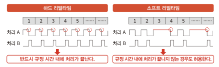
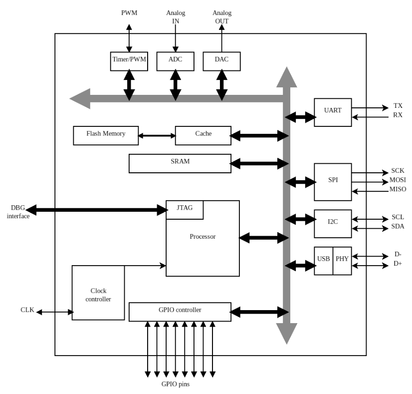
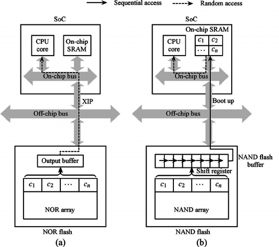

# 1 Embedded Systems

이 책에서는 **Embedded Linux**(임베디드 리눅스)를 다루지 않는다. Embedded Linux는 GNU/Linux OS의 번형을 운영하기 위한 충분한 power와 resource를 갖는 system에 해당된다. 이 말은 즉 GNU/linux 배포판으로 제공되는 모든 software 구성 요소를 저장하기 위해 최대 몇 GB의 RAM 여러 개를 갖추고 있는 기기에 해당된다.

> 또한 system의 각 process에 별도의 virtual space를 제공하기 위해, runtime에서 virtual address와 physical address 전환을 수행하는 **MMU**(Memory Management Unit)도 갖추고 있다.

이러한 linux 기반 system에서 요구하는 더 높은 resource나 hardware complexity는 energy consumption을 충분히 줄여주는 방향으로 설계되지 않는다.

이와 다르게 사양이 더 낮은 embedded system들에서는 짧고, 측정 및 예측이 가능한 시간 내에 일련의 작업을 수행하도록 설계된다. 이런 종류의 system을 **real-time system**(실시간 시스템)이라고 한다. 이 점에서 linux는 **hard real-time** system으로 설계되지 않았기 때문에, real-time system을 목적으로 설계된 제한된 **bare-metal**(베어메탈) system과 비교할 수 없다.

> hard realtime이란 수 밀리초의 deadline을 확실하게 준수해서 동작하도록 설계하는 것을 의미한다. 예를 들어 자동차나 로켓 엔진의 연소 제어 등에서 이러한 보장이 꼭 필요하다.

bare-metal이란 hardware 상에 어떤 software도 설치되어 있지 않은 상태를 뜻한다. 즉, OS와 같은 기본 **abstraction**(추상화)가 없는 hardware 환경을 뜻한다. 이런 환경에서는 주로 하나의 infinite loop로 실행되는 **firmware**(펌웨어)를 작성한다.

> embedded software는 hardware와 application software 사이에 위치해 있다는 의미로 firmware라고도 부른다. 경우에 따라 OS와 firmware를 합친 것을 embedded software로 부르는 경우도 있다.

> 이 책에서 Embedded System은 주로 MCU 기반의 hardware architecture를 중심으로 한다.

---

## 1.1 Hardware architecture

embedded system의 architecture는 **MCU**(microcontroller unit)라고 하는 마이크로컨트롤러를 중심으로 한다. 기본적으로 모든 MCU에 포함되어 있는 핵심 요소는 다음과 같다.

- microprocessor

- RAM

- Flash Memory

- serial transceiver(직렬 트랜시버)

이외 다른 device나 gateway와 통신하기 위해 network에 접속하곤 한다. 따라서 일부 MCU는 Ethernet, Wi-fi 인터페이스와 같은 표준이나, Sub-GHz 라디오 인터페이스, **CAN**(Controller Area Network) bus 같은 특정 protocol을 제공하기도 한다.

모든 구성 요소는 logic 조정을 책임지는 processor 내 bus line을 공유한다. 다시 말해 RAM, flash memory, transceiver의 control register(제어 레지스터) 모두 같은 물리 주소 공간에 mapping되어 있다.

> 보통 모델에 따라 RAM과 flash가 mapping된 address가 다르다.(보통 데이터 시트로 제공한다.)

MCU는 자신의 고유 기계 언어, 실행 중인 architecture에 적합한 binary file로 전달된 일련의 instruction으로 code를 실행한다. 기본적으로 compiler는 compile 결과로 일반적인 execution file과 target에서 실행 가능한 형태로 변환돼야 하는 assembly 연산을 제공한다.

processor는 보통 memory의 0 위치 또는 매뉴얼에서 지정한 다른 address에서 시작된다. 그리고 mapping된 내부 flash memory 및 RAM에서, processor 특정 binary type으로 저장된 instruction을 실행한다. CPU의 특성상 RAM에서 더 빠르게 code를 fetch할 수는 있지만, 보통 flash에 data를 저장해서 전원을 키거나 리부트 중에도 data를 유지할 수 있게 한다.

---

## 1.2 Embedded MCU 환경의 software

embedded MCU 환경에서 동작하는 software를 compile하고 flash memory에 loading하기 위해서는 우선 호스트 머신에서 test를 거칠 필요가 있다. 주의할 점은 이때 호스트 머신의 compiler에 target device에 대한 약간의 정보를 추가해야 할 수 있다. 

> 대체로 embedded software를 설계하기 위해 주로 C를 사용하며, Rust나 C++ 같은 고급 언어도 경우에 따라 사용한다.

현재 모든 embedded system 플랫폼은 debugging 목적으로 **JTAG**(Joint Test Action Group) 같은 메커니즘을 적어도 하나 가지고 있다. 이를 이용해 flash에 software를 upload하고, 호스트 머신에서 embedded system의 debugging 인터페이스에 접근할 수 있다. 그러면 debugger가 processor에서 **breakpoint**(중단점, debugging 목적으로 program을 의도적으로 멈추는 point) device와 상호작용하면서 debugging할 수 있다.

> JTAG는 특정 device(node)에서 digital I/O를 위해 Serial Bus(직렬 통신) 방식으로 output data를 출력하거나 input data를 수신하는 방식이다.

embedded system은 그 특성 때문에 여러 제약을 갖는다. 아래는 몇 가지 대표적인 예시다.

- 새로운 기능을 구현하는 데 필요한 충분한 memory space가 flash에 없을 수 있다.

- 복잡한 **struct**(구조체)를 저장하는 데 필요한 memory space가 RAM에 없을 수 있다.

  - 또는 대형 data를 buffer로 copy하는 작업이 불가능할 수도 있다.

- processor가 필요한 operation을 제때 수행하기에 속도가 부족할 수 있다.

- 배터리 구동 및 자원 수집 장치는 기기를 오래 쓸 것을 대비해서 더 적은 에너지를 소비하도록 설계해야 할 수 있다.

또한 PC나 mobile 환경의 OS는 MMU를 사용해서 physical address와 virtual address의 runtime 전환이 가능하게 하지만 embedded MCU는 MMU를 가지고 있지 않다. 따라서 embedded system은 특정 순서로 모든 data를 처리하고 통신하는 main loop를 가진 단일 task로 운영된다. (또한 embedded MCU는 kernel, application 및 library를 저장하기에는 flash 크기가 매우 부족하다.)

> MMU가 task들 간, 그리고 task와 kernel 자체의 address space 분리를 구현하기 위해 필수적인 abstraction인 점을 생각하자.

> 일부 embedded device는 아주 간단한 embedded OS를 이용해서 실행하기도 한다.

따라서 PC가 기본적인 system을 필수로 가정하고 개발하는 것과 다르게, embedded 개발은 보통 boot 절차부터 application logic까지 전체 system을 맨 처음부터 구현해야 한다. 게다가 embedded software들은 보통 (PC에 있는 kernel 간 memory 분리와 같은) 복잡한 abstraction이 부족하기 때문에 서로 더 연관성을 갖게 된다.

---

## 1.3 multi-threading

embedded system의 MCU는 resource의 **time-sharing**(시간 공유)를 통해, 별도의 execution unit 내에서 논리적으로 작업을 분리해서 수행하도록 하는 **multi-threading**(멀티스레딩)을 구현할 수 있다.

보통 embedded software는 단일 loop 기반의 in-order processing model이지만, 최신 MCU는 multi-tasking 환경을 구축할 수 있는 기능과 핵심 logic 특성을 제공한다.

> 단일 loop 기반의 순차 실행 모델에서는 보통 module과 구성 요소들이 서로 callback 인터페이스로 연결되어 있다.

---

## 1.4 RAM

embedded system 설계에서는 모든 연산을 위해 잠재적으로 필요한 memory size, 주변 device와 통신을 하기 위해 사용하는 buffer를 항상 고려해야 한다. 어느 정도 다행인 점이라면 최신 PC의 MMU는 OS가 virtual address를 physical address로 translation하는 등의 작업을 거치므로 memory model을 다루기 어렵지만, embedded system에서는 MMU가 없으므로 address translation의 복잡한 면을 고려하지 않아도 된다.

> 반면 swapping이나 memory relocation 등을 통한 dynamic address space size 재조정 같은 기능은 구현하기 힘들고, 때로는 불가능하다.

embedded system에서 memory 처리는 특히나 더 중요하다. PC와 한 번 비교하며 그 이유를 알아보자.

- PC: MMU를 이용해 virtual address space를 쓰면 memory 영역이 서로 겹치지 않는다. 또한 OS는 승인되지 않은 memory access 또는 **segmentation violation**(세그멘테이션 위반)을 쉽게 찾아내서 해당 process를 즉각 종료시키고 system의 손상을 방지한다.

- embedded system: (특히 bare-metal code 작성 시) 각 address pool의 경계를 수동으로 확인해야 한다. 우연히 잘못된 memory의 몇 bit를 수정하거나 잘못 접근하는 것만으로도 돌이킬 수 없는 치명적인 오류가 발생할 수 있다.

---

## 1.5 Flash Memory

embedded device의 firmware는 보통 모든 software 구성요소를 포함한 단일 binary file이어서, MCU 내부의 flash memory로 전달이 가능하다. 이때 flash에 고정 address로 mapping되기 때문에, processor가 중간 단계를 거칠 필요 없이 memory에서 단일 instruction을 직접 가져와 실행할 수 있다. 이런 메커니즘을 **XIP**(execute in place)라고 한다.

> firmware에서 변경이 불가능한(constant, instructions) 모든 부분은 **direct addressing**(직접 주소 지정)으로 접근할 수 있다.

- 양쪽 모두 flash memory에서의 program execution 방식 예시다. (a)는 XIP, (b)는 **Code shadowing**이다.

- XIP: flash memory에서 execute code들을 직접 **Random access**로 가져온다.

  - random access란 memory의 첫 번째 address부터 sequential하게 접근할 필요 없이, 특정 address를 직접 선택해서 신속하게 접근할 수 있는 방식을 의미한다.

- Code Shadowing: boot 시 모든 code를 RAM에 copy한다. ( $C_{i}$ 는 $i$ 번째 code page를 의미한다. )

flash memory에서 address 영역에 mapping된 공간은 write를 위한 접근이 불가능하다. 또한 flash memory의 내용을 변경하려면 오직 block 단위로 삭제하고 다시 작성하는 방법밖에 없다. 

> 이런 block 기반 flash memory access 메커니즘을 **IAP**(In-Application Programming)이라고 한다.

> write 작업의 비효율성 때문에 runtime의 data를 저장하기 위해, MCU 외부의 flash memory를 사용하기도 한다. (외부 flash memory는 physical address 공간에 direct addressing을 허용하지 않으므로 firmware 저장에는 적합하지 않다.)

---

## 1.6 Interface and Peripheral

여러 peripheral과 다른 MCU와 통신하기 위해 embedded system에서는 여러 표준을 사용한다.

- 비동기 UART 기반 serial bus

  - 간단히 **serial port**(직렬 포트)로도 불린다.

  - 송수신자간의 동기화를 위해 clock 신호 공유가 필요하지는 않지만, 통신에서는 사전에 정의한 clock speed로 작업한다.

- SPI(Serial Peripheral Interface) bus

- $I^{2}C$ (Inter-Integrated Circuit) bus

- USB(Universal Serial Bus)

> 네트워크 연결 설명은 생략한다.

---

## 1.7 Reference Platform

embedded CPU core는 기본적으로 **RISC**(Reduced Instruction Set Computer)를 바탕으로 설계된다. 여러 레퍼런스 설계가 있으며, 한 레퍼런스 설계에서 공유되는 특징은 다음과 같다.

- register 및 address에서 사용되는 **word** size(8bit, 16bit, 32bit, 64bit)

- Instruction Set

- register setting

- endianness(엔디언)

- 확장된 CPU 기능(interrupt controller, FPU(Floating Point Unit), MMU 등)

- cache strategy

- pipeline 설계

> embedded 시장에서는 보통 ARM의 레퍼런스 설계가 으뜸으로 취급된다. 가장 주목을 받는 건 ARM Cortex-M 제품군으로 cost, energy efficiency가 높은 제품부터, 멀티미디어 MCU를 위한 고성능 core 제품 등 다양한 제품이 존재한다.

---

