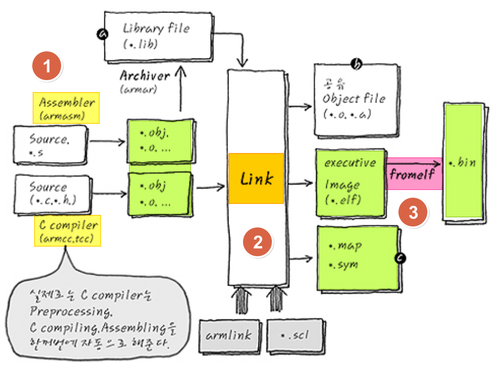
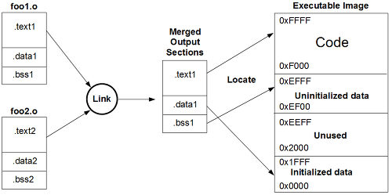
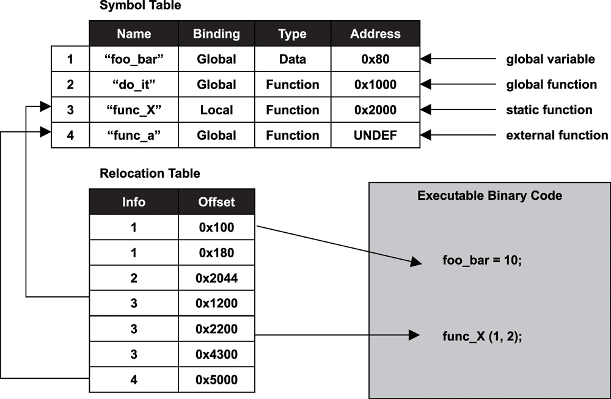
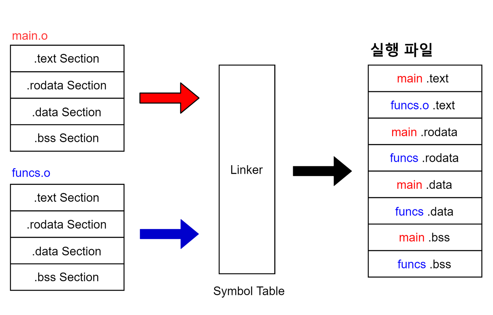
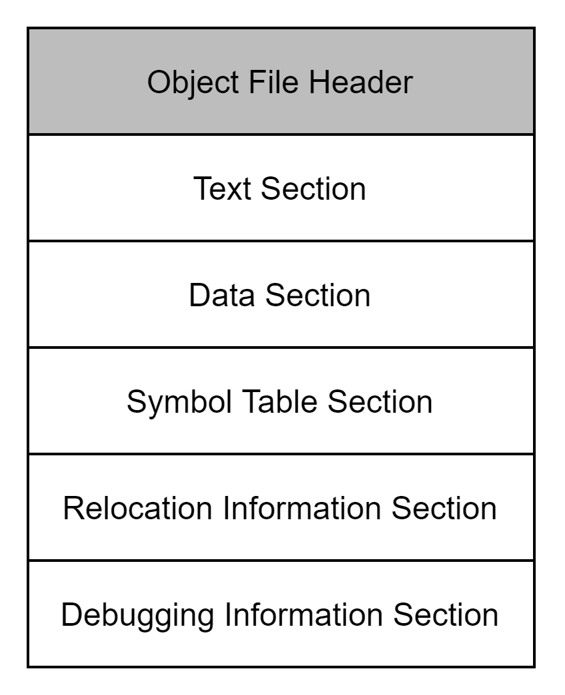

# 2 작업 환경과 워크플로 최적화

C로 software를 작성할 때는 해당 장치(target)에서 실행 가능한 형태로 code를 전환해야 한다. 따라서 compile, link, execution, debugging 과정에서 해당 장치에 맞는 도구가 필요하다.

이러한 도구는 target에서 맞는 firmware를 생성해 주는데, 이를 바로 **toolchain**(툴체인)이라고 한다.

잠시 이런 도구들이 생긴 배경을 다시 살펴보자. target의 processor마다 **bit pattern**, 즉 기계어가 다른 방식으로 약속되어 있기 때문에, processor A에서는 동작해도 processor B에서는 동작하지 않을 수 있다.

> 컴퓨터 구조마다 사용하는 기계어가 다르고, operation type, register의 개수, 저장된 data type 등이 모두 다르기 때문이다.

> 또한 이 bit pattern(기계어)은 사람이 읽기에는 너무 어려우므로, 1:1 대응을 시킨 표기법으로 **assembly**(어셈블리, mnemonic)가 탄생했다.

따라서 processor에 약속된 bit pattern으로 매칭이 될 수 있는 assembly를 자동으로 만들어주는 compiler가 등장한다. 덕분에 사람들은 processor가 어떤 약속을 쓰는지 거의 신경쓰지 않고, C/C++과 같은 프로그래밍 언어로 개발을 할 수 있게 되었다.



---

## 2.1 C compiler

C compiler는 source code를 machine code로 변환하는 도구이다. 간단히 다음과 같은 과정을 거쳐서 해당 기계에 약속된 기계어로 변환하게 된다.

- machine-specific instruction으로 function을 변환한다. 

- architecture의 address model과 register layout을 사용하도록 설정한다.

대부분의 GNU/linux 배포판에 포함된 기본 compiler는 **GNU Compiler Collection**(GNU 컴파일러 컬렉션)이다. 보통 **GCC**로 알려져 있다. 

GCC compiler는 <U>확장자가 .c인 source file을 가지고 확장자가 .o인 **object file**을 만든다.</U> 

- object file: source file에서 machine instruction으로 해석된 정보가 담긴 파일. function, variable의 초깃값 등이 포함된다.

예를 들어 다음 명령은 hello.c source file에 있는 C code를 compile하고, machine-specific한 hello.o object file을 만들어 낼 것이다.

```bash
$ gcc -c hello.c
```

개발 머신(호스트 PC)에서 구동되고, target(ARM processor)에서 실행될 수 있는 machine-specific code를 생성하는 compile 과정을 구분해서 **cross-compilation**(크로스 컴파일)이라고 부른다. 

program을 만들기 위해서는 여러 module이 필요하고, 이 module이 object file들로 구성되는 것이다.

아래는 C compiler가 수행하는 절차를 순서대로 요약한 것이다. preprocessing, C compiling, Assembling을 한꺼번에 처리해 준다.

> [C compile 과정 이해](https://bradbury.tistory.com/226)

1. **preprocessor**(전처리기): header file(`.h`)과 macro를 source file(`.c`)로 옮기는 optimization 작업을 수행한다. 결과물은 `.i` file이 된다.

    - `#include` 지시문을 찾으면 해당하는 header file(`.h`)를 찾고, 내부의 모든 내용을 복사해서 source code에 삽입한다. (즉, 복사해서 넣기만 하고 compiler는 header file을 쓰지 않는다.)

    - `#define` 지시문으로 정의된 macro를 만나면, 모두 `#define`된 내용으로 치환해 준다.

    > 참고로 주석도 전부 제거해 준다.

2. **compiler**: 최적화가 된 `.i` file을 compile해 assembly를 만든다. 결과물은 `.s` file이 된다.

    > 흔히 말하는 언어의 문법 검사가 이루어진다. 또한 **static** 영역(`.data`, `.bss`)의 memory allocation이 수행된다.

    - 언어 종속적인 부분을 처리하는 **front-end**, architecture 독립적인 최적화를 수행하는 **middle-end**, architecture 종속적인 최적화를 수행하는 **back-end** 과정이 순차적으로 진행된다.

    > gcc는 이 세 과정이 깔끔하게 분리되어 있지 않다. 반면 다른 C compiler인 clang, LLVM은 단계가 잘 분리되어 있다.

3. **assembler**: assembly인 `.s` file을 object file로 만든다. 결과물은 `.obj` file이 된다.

이제 여러 `.obj` file과 library(`.lib`)를 묶어서 하나의 실행 가능한 파일(**Executable & Linkable Format**)을 만들어 주는 linker를 살펴보자.

> compile과 linking을 합쳐서 **build**라고 지칭하기도 한다.

---

## 2.2 Linker

**linker**(링커)는 object file로 실행 가능한 파일(Executable & Linkable Format)을 구성해 주는 도구다. compile이 끝나고 생성된 module(object file들)의 **symbol** dependency를 처리해서 실행 파일(`.elf`)로 만든다.

> symbol(간단히 variable, function을 의미한다.) dependency를 처리한다는 말은, object file 내 존재하는 symbol reference(참조)를 각각의 definition(정의)과 연결시켜서 해석하는 과정을 의미한다. 

> symbol의 정확한 정의는 'memory에 자신만의 고유한 address를 갖는 data를 지칭하는 단위'이다. 고유 address를 갖는 global function, global variable, static variable이 어디서나 참조될 수 있는 것을 생각해 보자.

> [symbol resolution(심볼 해석)](https://kfgd.tistory.com/13)


> 사실 포맷은 OS에 따라 다른데, Windows의 경우 **PE**(Portable Executable), Linux의 경우 **ELF**(Executable and Linkable Format)이다.

linker가 처리하는 symbol은 다음과 같은 section으로 구성된다.



- `.text`: program code를 포함한다. **Read Only**(RO, 읽기 전용)이다.

- `.rodata`: `const` 즉 상수를 저장한다. (당연히) **Read Only**이다.(`.text`에 속하기도 한다.)

- `.data`: initialization된 variable, `static` 같은 global variable을 저장한다. **Read Write**(RW, 읽기 쓰기) 모두 가능하다.

- `.bss`: initialization되지 않은 variable이 저장되는 공간이다. **Read Write** 모두 가능하다.(모두 <U>0으로 초기화</U>된다. 이를 **ZI**(Zero Initialized)라고 한다.)

> 읽기 전용 section은 flash, 읽기/쓰기가 가능한 section은 ROM, RAM 양쪽 다 mapping된다. 단 `.bss`(ZI)는 RAM에 mapping된다.

그림을 보면 알 수 있듯이, 실행 파일을 이루는 각 section들의 address를 지정해 주는 것도 linker가 수행하는 작업이다. 이때 linker가 제대로 address를 지정할 수 있도록 정보를 주는데, 이것을 **linker script**이라고 한다.

linker script에는 target의 memory section 정보가 서술되어 있다. 또한 program이 실행되기 전에 꼭 필요한 symbol 등의 정보도 포함되어 있다. 확장자는 `.ld`이며, target 기기의 RAM, flash에 program을 배포하기 위해서는 꼭 필요하다.

> 혹은 scatter loading file(`.scl`)을 제공할 수 있다. 여기에는 binary를 차곡차곡 쌓지 않고, 원하는 위치에 읽을 수 있도록 지정하는 정보가 들어 있다.

예시로 간단한 linker script의 내부 code를 살펴보자. 해당 target의 flash, RAM 정보가 기술되어 있다.

```
MEMORY {
    FLASH(rx) : ORIGIN = 0x00000000, LENGTH = 256K
    RAM(rwx) : ORIGIN = 0x20000000, LENGTH = 64K
}
```

---

### 2.2.1 symbol resolution과 relocation

linker가 mapping하는 과정을 자세히 살펴보자. 이 과정은 크게 **symbol resolution**(심볼 해석)과 **relocation**(재배치) 두 단계로 나뉜다.

우선 symbol resolution은 symbol reference를 어떤 definition과 연관지을지 결정하는 작업이다.(예를 들어 여러 object file에 같은 이름의 function이나 variable이 있을 수 있다.)



relocation은 data나 memory reference의 address를 알맞게 배치하는 작업이다.



> 참고로 이 과정을 거치기 전의 object file을 **Relocatable Object File**(ROF)이라 불러서 구분짓기도 한다. 그리고 relocation이 끝난 object file을 **Executable Object File**(EOF)라고 부른다.

거슬러 올라가 linker가 작업을 위해 전달받은 object file의 format을 살펴보자. 다음과 같은 section으로 나뉘게 된다.



- object file header: object file의 기초 정보를 가진 header

- text section: compiler에 의해 기계어로 변환된 code가 담긴 section

- data section: data(global, static)가 든 section

- symbol table section: reference되는 symbol의 이름과 address가 든 section

- relocation information section: **assembler**가 **ultimate location**(궁극적 위치)가 알려지지 않은 object의 reference를, linker가 어떻게 처리해야 할지 정리한 정보(relocation entry)가 든 section

  > assembler가 reference를 어떻게 처리할지 모르니까, linker에게 이들 address를 명시해 달라고 부탁한 것으로 생각하면 된다.

- debugging information section: debugging을 위한 정보가 든 section

---

### 2.2.2 relocation 예시

> [compile + link 예시](https://velog.io/@embeddedjune/%EC%9E%84%EB%B2%A0%EB%94%94%EB%93%9C-%EB%A0%88%EC%8B%9C%ED%94%BC-%EC%9A%94%EC%95%BD-%EB%B0%8F-%EC%A0%95%EB%A6%AC-Chapter-3.-SW-%EC%BB%B4%ED%8C%8C%EC%9D%BC%EB%A1%9C%EB%93%9C)

예제 code를 보며 직접 relocation이 어떻게 수행되는지 파악하자. 우선 아래와 같이 간단한 C source code가 있다고 하자.

```c
int arr[2] = {1, 2};

int main(void) {
    int val = sum(arr, 2);
    return val;
}
```

이 code를 compile(preprocessor, compiler, assembler 3단계)해서 나온 object file, 즉 Relocatable Object File의 `.text` section은 다음과 같은 모습이다.

> GNU의 [objdump](https://ko.wikipedia.org/wiki/Objdump) 유틸리티를 사용하면 ELF file을 assembly로 확인할 수 있다.

```asm
0000000000000000 <main>:
	0: 48 83 ec 08 				sub $0x8,%rsp
	4: be 02 00 00 00 			mov $0x2,%esi
	9: bf 00 00 00 00 			mov $0x0,%edi 			# %edi = &arr (주소)
					a: R_X86_64_32 arr					# Relocation entry
	e: e8 00 00 00 00 		callq 13 <main+0x13> 	# sum() 함수 호출
					f: R_X86_64_PC32 sum-0x4 			# Relocation entry
	13: 48 83 c4 08 			add $0x8,%rsp
	17: c3 						retq
```

- \<main\> function의 address는 아직 0000000000000000이다.

- sub \$0x8, \%rsp: sub는 **subtract**의 약자로, rsp에서 0x8을 빼서 넣는다.

  - rsp는 stack의 최상위 pointer 값을 가진 register로, 다시 말해 stack의 맨 위의 값을 가리킨다. 
  
  > 참고로 stack의 base pointer는 rbp이다.(rbp는 주로 stack에 있는 function parameter나 local variable을 참조하기 위해 사용한다.)

  > 이렇게 rsp의 address에서 0x8을 빼주는 이유는 memory에서 stack이 작동하는 원리를 알아야 한다. data structure 관점에서 stack은 쌓아 올리는 형태이지만, 실제 memory에서는 깎아 내려가는 형태이다.

  > 즉, `main()` function을 사용하기 위해 임시로 0x8만큼의 공간을 stack에 할당한 것이다.

- mov \$0x2, \%esi, mov \$0x0, \$edi: esi(Extended Source Index), edi(Extended Destination Index)로, copy 시 각각 source data의 address, destination의 address가 복사된다.

- retq: \%rax를 반환하고 function을 종료한다.

여기서 자세히 볼 부분은 바로 compiler가 만들어 둔 relocation entry다.

- 9: bf 00 00 00 00: array의 base point를 가리키는 address가 어딘지 알아야 한다. 하지만 compile 단계에서는 이를 모르기 때문에 0으로 채워놓게 된다.

- e: e8 00 00 00 00: 현재 위치에서 얼마나 떨어진 곳에 function이 위치해 있는지를 나타내는 offset이 적혀 있어야 한다. 하지만 compile 단계에서는 이를 모르기 때문에 0으로 채워놓게 된다.

- R_X86_64_32, R_X86_64_PC32: linker에게 해당 방식으로 symbol의 정보를 덮어 씌우라고 알려 준다.

만약 여기서 sum() function을 찾을 수 없다면 다음과 같은 컴파일 오류가 발생할 것이다.

```bash
/usr/bin/ld: /tmp/ex.o: in function `main':
b.cc:(.text+0xf): undefined reference to `sum()'
collect2: error: ld returned 1 exit status
```

이제 linker가 relocation한 Executable Object File의 `.text` section을 살펴보자.

```
00000000004004d0 <main>:
	4004d0: 	48 83 ec 08 		sub 	$0x8,%rsp
	4004d4: 	be 02 00 00 00 		mov 	$0x2,%esi
	4004d9: 	bf 18 10 60 00 		mov 	$0x601018,%edi 	# %edi = &array
	4004de: 	e8 05 00 00 00 		callq 	4004e8 <sum> 	# sum()
	4004e3: 	48 83 c4 08 		add 	$0x8,%rsp
	4004e7: 	c3 					retq

00000000004004e8 <sum>:
	4004e8: 	b8 00 00 00 00 		mov 	$0x0,%eax
	4004ed: 	ba 00 00 00 00 		mov 	$0x0,%edx
	4004f2: 	eb 09 				jmp 	4004fd <sum+0x15>
	4004f4: 	48 63 ca 			movslq 	%edx,%rcx
	4004f7: 	03 04 8f 			add 	(%rdi,%rcx,4),%eax
	4004fa: 	83 c2 01 			add 	$0x1,%edx
	4004fd: 	39 f2 				cmp 	%esi,%edx
	4004ff: 	7c f3 				jl 		4004f4 <sum+0xc>
	400501: 	f3 c3 				repz retq
```

- main()은 0x4004d0, sum()은 0x4004e8에 위치되었다.(즉 main()에서 0x5만큼 더하면 sum()를 가리키게 된다.)

  - 4004de: 	e8 05 00 00 00 부분이 바로 0x5만큼 더하면 sum()이 나오는 것을 나타낸다.

이처럼 memory address가 allocate된 것을 확인할 수 있다.

---