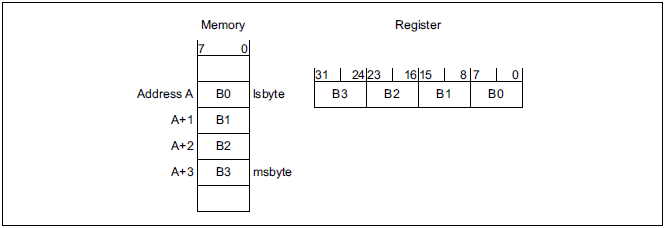
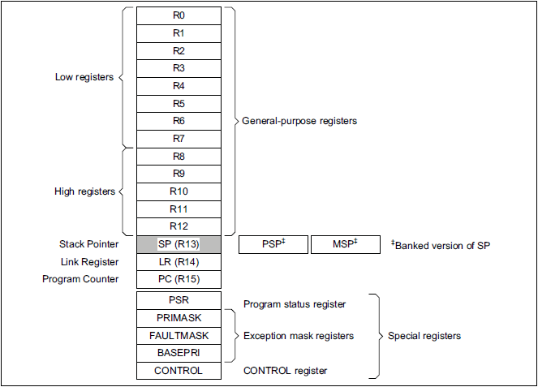
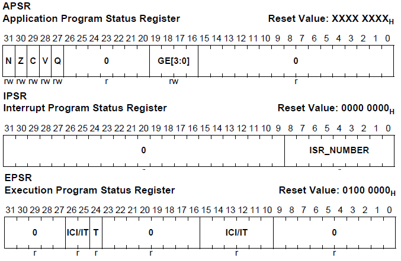
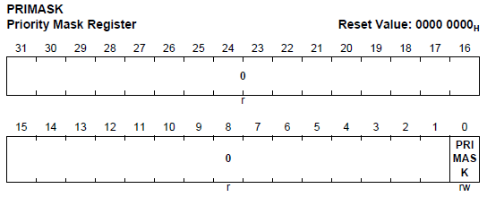
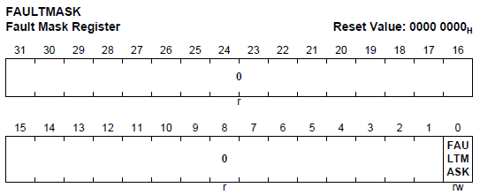
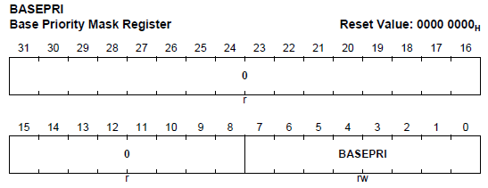
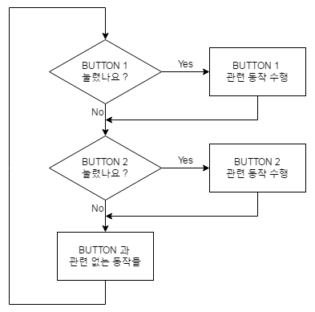
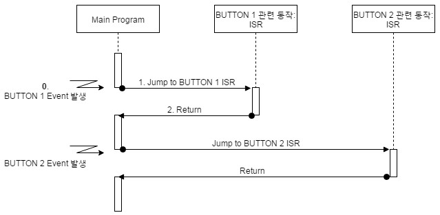
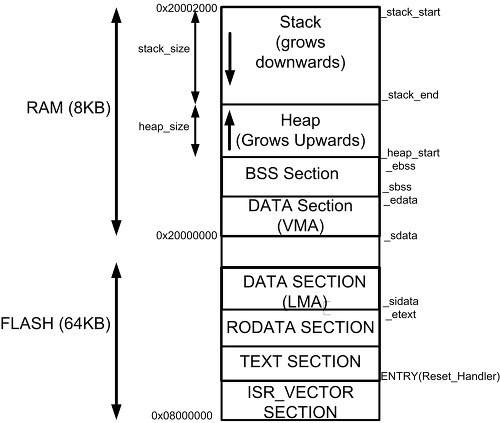

# 4 Subsystem, Interrupt, Boot-up Process

들어가기 앞서 ARM processor가 갖는 7가지 mode를 살펴보자.

- **CPSR**: Current Program Status Register로, processor의 state information을 저장하는 register이다.

| mode | 설명 | CPSR M[4:0] |
| :---: | --- | :---: |
| User | User Task나 Application을 수행하는 mode이다.<br/>memory, I/O device 등의 system resource를 사용하는 데 제한을 둬서 실수를 방지한다.<br/>다른 mode(SVC)로 이동하려면 software interrupt를 발생시켜야 한다. | 10000b |
| FIQ<br/>(Fast IRQ) | interrupt를 빠르게 처리하기 위해 구성된 mode.<br/>빠른 처리를 위해 Exception Vector에서 최하단에 존재하며, 별도의 resistor를 소유한다. | 10001b |
| IRQ<br/>(Interrupt Request) | 외부 device의 요청되는 IRQ를 처리하는 mode | 10010b |
| SVC<br/>(Supervisor Call) | OS kernel이 사용하는 mode<br/>대부분의 system 자원을 자유롭게 관리할 수 있다.<br/>**Reset** 신호가 입력되거나 **SWI**가 발생하면 바로 SVC mode로 전환된다. | 10011b |
| Abort | memory access 중에 발생하는 fault를 처리하는 mode | 10111b |
| Undefined | instruction이 정의되지 않은 경우 발생하는 fault를 처리하는 mode | 11011b |
| System | User mode와 SVC mode의 조합으로, User mode의 제약을 없애고 SVC mode의 기능을 추가한 mode | 11111b |

또한 ARM Cortex-M7은 다음과 같은 data type을 지원한다.

- 32bit words

- 16bit halfwords

- 8bit bytes

- FPU(Floating-Point Unit)가 구현되어 있을 경우

  - 32bit single-precision floating point numbers

  - 64bit double-precision floating point numbers

또한 모든 data는 little-endian으로 처리한다.



- memory에 있는 Address A ~ A+3까지의 data를 읽어오는 경우, 다음 순서로 가져오게 된다.(register가 4byte 크기이므로, memory에서 4byte씩 읽어온다.)

  - little-endian: A+3, A+2, A+1, A

  - big-endian: A, A+1, A+2, A+3

---

## 4.1 programmer model

processor mode와 privilege level(특권 레벨)이 무엇인지 알아보자.

**processor mode**: processor가 현재 수행하고 있는 작업의 종류를 나타낸다.

- thread mode: 일반 application이 동작되는 mode이다. processor가 reset된 후에는 thread mode로 시작한다.

- handler mode: exception이 발생했을 때, exception handler가 동작되는 mode이다.(모든 exception 처리가 끝나면 thread mode로 돌아간다.)

**privilege level**: processor가 현재 수행하고 있는 작업의 권한을 나타낸다.

- privileged: processor가 privileged instruction을 수행할 수 있는 권한을 가진다. 다시 말해 아무런 제약 없이 모든 instruction을 수행할 수 있으며, 모든 resource에 접근할 수 있다.

- unprivileged: privileged instruction을 수행할 수 없으며, 수행하려고 하면 processor는 exception을 발생시킨다.(일반 instruction만 수행할 수 있다.)

  - 예를 들어 범용 register는 모든 instruction으로 register에 접근할 수 있지만, system register는 MSR, MRS와 같은 privileged instruction으로만 접근할 수 있다.

  - 이때 privileged instruction을 수행하려고 할때 발생하는 exception은 **memory abort** type이다.

이런 구분은 OS를 사용하는 program에서 hardware 접근 권한을 관리하기 위해 만든 기능이다. 따라서 OS를 사용하지 않거나 작은 RTOS를 사용하는 system에서는 이런 구분 없이 privileged level에서 동작하게 된다.

---

## 4.2 core register

다음은 ARM cortex-M7의 register file이다. core에 위치해서 매우 빠르게 접근할 수 있다.



- R0 ~ R12: 범용(**general-purpose**) register로, data나 address와 같은 정보를 저장하는 용도로 사용한다.

  - R0~R7을 low register, R8~R12를 high register라고 부른다.

  - low register는 ARM instruction(32bit), Thumb instruction(16bit) 모두 접근할 수 있지만, high register는 ARM instruction(32bit)만 접근할 수 있다.

- R13(**SP**): **stack pointer**로, stack의 top을 가리킨다. Cortex-M7 processor 두 가지 stack을 가지고 있다.

  -  Main Stack Pointer(**MSP**)와 Process Stack Pointer(**PSP**)가 있다. mode에 따라 사용할 수 있는 stack이 다르다. 
  
  - thread mode: main stack과 process stack 중 하나를 사용한다.

  - handler mode: main stack만 사용한다.

- R14(**LR**): **link** register로, function call 시 return address를 저장한다.

- R15(**PC**): program counter(PC)로, fetch를 해서 가져온 instruction의 address를 가리킨다.

나머지 register는 문단을 나눠서 설명한다.

---

### 4.2.1 PSR(Program Status Register)

**PSR**(Program Status Register)은 말 그대로 processor의 state를 나타내는 register이다. PSR은 32bit로 구성되어 있으며, 세 개의 register 조합으로 구성되어 있다.



- APSR(Application Program Status Register)

- IPSR(Interrupt Program Status Register)

- EPSR(Exception Program Status Register)

이 register의 모든 bit들은 서로 겹치지 않게 allocate되어 있다. 개별적으로도 접근할 수 있으며, 동시에 여러 register 정보에 접근할 수도 있다.

| PSR register combination | type | combination |
| :---: | :---: | :---: |
| PSR | read-write | APSR, EPSR, IPSR |
| IEPSR | read-only | IPSR, EPSR |
| IAPSR | read-write | APSR, IPSR |
| EAPSR | reat-write | APSR, EPSR |

---

### 4.2.2 Exception Mask Registers

**Exception Mask Registers**는 exception 발생 시, interrupt를 mask할 수 있는 register이다.

> 따라서 실행 시간이 중요한 task를 처리할 때 유용하게 사용할 수 있다.

PRIMASK, FAULTMASK, BASEPRI가 있다.

- **PRIMASK**

  

  Priority Mask Register의 줄임말로, PRIMASK의 bit[0]이 1이면 <U>interrupt를 mask</U>하고, 0이면 interrupt를 mask하지 않는다.

- **FAULTMASK**

  

  Fault Mask Register의 줄임말로, FAULTMASK의 bit[0]이 1이면 <U>fault를 mask</U>하고, 0이면 fault를 mask하지 않는다.

  > <U>NMI(Non-Maskable Interrupt)를 제외한 exception의 처리를 mask</U>한다.

- **BASEPRI**

  

  Base Priority Register의 줄임말로, BASEPRI의 bit[7:0]은 <U>interrupt priority를 mask</U>한다. 즉, BASEPRI의 bit[7:0]보다 낮은 **priority**를 가진 interrupt는 발생하지 않는다.

  > exception의 처리의 최소 priority(우선 순위)를 관리하는 것이다.

---

### 4.2.3 Control Register

**Control Register**는 processor의 동작을 제어하는 register이다.

- privilege level을 결정한다.(unprivileged, privileged)

- stack pointer를 결정한다.(main stack, process stack)

- FPU(Floating Point Unit) 사용 여부를 결정한다.(사용, 사용하지 않음)

---

## 4.3 event 처리

> [Interrupt](https://xmctutorial.readthedocs.io/ko/stable/Interrupt/index.html)

Embedded system에서 정보를 처리할 때는 꼭 시간을 고려해서 처리해야 한다. 예를 들어, 1초에 한 번씩 LED를 깜빡이는 작업을 수행한다고 가정해보자. 이를 위해서는 1초에 한 번씩 interrupt를 발생시켜야 한다. 

> 이러한 interrupt는 **timer**를 통해 발생시킬 수 있다.

일반적으로는 다음과 같은 작업을 수행할 수 있어야 한다.

- 일회성, 혹은 반복적인 time based event를 처리

- 예측할 수 없는 시각에 발생하는 외부 event를 실시간으로 처리

그런데 이런 처리를 할 때 system 상에서 두 개 이상의 event를 동시에 처리해야 하는 경우도 발생하게 된다. 예를 들어 주기적인 일을 처리하는 thread와 외부 event를 처리하는 thread가 동시에 발생하는 경우를 생각할 수 있다. 따라서 이런 경우를 위한 특별한 메커니즘이 필요하다.

interrupt가 바로 CPU에서 수행하던 일련의 작업을 중단하고, event를 우선 처리한 뒤, 중단한 작업을 다시 수행하는 메커니즘이다.

---

### 4.3.1 polling

사용자가 button을 누르는 간단한 Event-triggered 동작을 생각해 보자. event가 발생한 것을 어떻게 확인하고 처리할 수 있을까?



- button이 입력되는지를 infinite loop로 계속 확인하게 둘 수 있다. 

이렇게 외부 event를 확인하는 방식을 **polling**(폴링)이라고 지칭한다. 다만 간단한 system에서는 잘 돌아가지만, 복잡한 program에서는 적합하지 않다.

가령 MCU가 loop에서 20개의 input signal을 처리해야 한다고 생각해 보자. polling 방식이라면 입력이 되지 않더라도 20개의 input signal을 계속 확인해야 한다. 이는 매우 비효율적이다.

게다가 더 중요한 error가 발생해서 긴급하게 처리해야 하는 상황에서도, 상대적으로 덜 중요한 다른 input signal을 확인하면서 시간을 낭비하게 된다.

문제점을 요약하면 다음과 같다.

- polling routine을 수행하는 동안, processor는 다른 동작을 시킬 수 없게 된다.

- 모든 input이 동일하게 처리되기 때문에, 중요한 input signal과 상대적으로 덜 중요한 input signal을 구분할 수 없다.

따라서 input signal을 처리하는 방식을 polling이 아닌 interrupt-driven 방식으로 처리하기 시작했다. interrupt로 event를 알려주면, system에서는 input signal을 계속해서 확인할 필요가 없어서 낭비가 사라지고, 중요한 input signal을 먼저 처리할 수 있게 된다.

---

### 4.3.2 interrupt

그러면 polling 방식의 대안으로 interrupt를 살펴보자. interrupt를 전화로 비유할 수 있다.

- CPU는 전화가 오는 것(interrupt)를 기다린다.

  - 만약 벨소리와 같이 전화가 왔다는 걸 알려주는 신호가 없다면, CPU는 계속 전화기를 살펴보며 긴장하고 있어야 한다.

  - 하지만 벨소리(interrupt mechanism)가 있다면 전화를 기다리는 동안 독서나 책상 정리 등 다른 일을 할 수 있다.

> 초기 CPU는 interrupt를 처리하기 위한 dedicated hardware가 없었다. 또한 1~2개의 interrupt만 처리할 수 있었다.

> 이런 문제를 해결하기 위해 interrupt controller를 도입되었고, 현재는 수십 개가 넘는 interrupt source를 처리할 수 있게 설계된다.

다음은 interrupt를 사용해서 외부 event를 처리하도록 구성한 예제이다.



- BUTTON 1 Event 발생: 현재 수행 중이던 일반 program(여기서는 main program)을 중단하고 'BUTTON 1 Event'를 처리하는 **ISR**(Interrupt Service Routine)을 수행한다.

  - BUTTON 1 event 처리가 완료되면, 중단되었던 Main Program으로 돌아가서 다시 계속 수행한다.

program을 중단하고 interrupt를 처리하는 것을 **context switch**라고 한다. 이 메커니즘을 좀 더 자세히 살펴보면 다음과 같다.

1. interrupt가 발생하면 MCU가 자동으로 이를 인식한다.

2. CPU가 interrupt를 인식하면 현재 수행하고 있던 code를 중지하고, 해당 code의 정보인 **context**를 stack에 저장한다.

3. 현재 발생한 interrupt 관련 수행 code, ISR가 어디에 있는지 관리하는 table인 **IVT**(Interrupt Vector Table)를 참조하여 해당 ISR을 수행한다.

4. ISR의 수행이 마무리되면, 앞서 중단한 code로 돌아온다.(stack에 저장되어 있던 context를 복원하여 원래의 동작을 계속 수행한다.)

이런 interrupt 처리를 구현하기 위해서는 다음과 같은 환경을 구성해야 한다.

- interrupt 활성화 설정

    대부분의 subsystem(system에서 작업이 처리되는 위치)에서는 interrupt 발생 여부를 CPU에 알려주는 기능을 활성/비활성화 할 수 있게 구성되어 있다. 그런데 <U>default는 비활성화</U>이므로, 따로 활성화 설정을 해야 한다.

    > hardware 정보를 살피며 주의 깊게 설정해야 한다.

- interrupt vector table 구성

    CPU에서 처리할 수 있는 <U>interrupt의 종류는 해당 hardware에서 미리 정의</U>하고 있다. 그리고 모든 ISR(Interrupt Service Routine)을 table 형태로 특정 address space에 위치시켜야 한다.

    > C언어에서는 linker 등을 이용해서 ISR의 base address, function pointer 등으로 특정 address space에 위치시킨다.

이때 정의된 interrupt service routine 형식으로 프로그래밍할 필요가 있다. C언어 기준으로 일반 function 형태이며, ISR으로 parameter나 return 값을 전달하기 위해서는 global variable을 사용해야 한다.

> ISR은 최대한 단순하고 짧게 설계할수록 좋다. 

---

## 4.4 IVT(Interrupt Vector Table)

**IVT**(Interrupt Vector Table)은 interrupt를 처리하기 위한 handler function인 **ISR**(Interrupt Service Routine) pointer가 모인 array이다. 

**Interrupt Handler**(인터럽트 핸들러)라는 명칭으로도 불리며, device driver에서 요구하는 일을 처리하는 기능적 code set으로 callback routine으로 처리된다.

IVT는 주로 binary image 시작 부분에 기술되고, flash memory의 base address에 저장된다.

아래 그림을 보자. RAM(8kB)와 flash(64kB)의 memory mapping을 나타낸 그림이다. IVT는 flash의 base address인 0x08000000에 저장되어 있다.



ARM Cortex-M에서 정의한 system interrupt의 종류는 다음과 같은 것들이 있다.

- hardware **RESET**

- **NMI**(Non-Maskable Interrupt):  내부 system 칩셋 오류, memory 손상 문제, parity 오류 등 즉각적으로 처치해야 하는 interrupt 유형이다. 이름 그대로 interrupt masking 기술로 무시할 수 없다.

- **Hard fault**: exception 처리 메커니즘으로 처리할 수 없는 모든 fault를 의미한다. 일반적으로는 복구할 수 없는 system 오류를 뜻한다.

  > [Cortex-M에서의 hard fault](https://www.iar.com/kr/knowledge/support/technical-notes/debugger/debugging-a-hardfault-on-cortex-m/): overclock(CPU를 매우 빠른 주파수 클럭으로 설정), division by zero, accessing an invalid address, branch to an address where no code is located 등

- **memory exception**: 정해진 memory 밖으로 access

- bus fault

- usage fault

- supervisor call(scheduler)

- **debug monitor**(breakpoint)

- PendSV(Shared resource, **Semaphone** ...)

- **System tick**(timer)

---

## 4.5 memory layout

linker script의 `.text`에는 제일 먼저 IVT와 관련된 부분이 들어간다.

```
.text : {
    *(.isr_vector),
    *(.text),
    *(.rodata)
} > FLASH	// Flash에 할당되는 읽기전용 내용들
```

system이 bootup하기 위해서는 먼저 IVT가 실행되고, 'reset handler' function이 실행되어야 한다. reset handler가 `.bss`, `.data` section에 정의된 symbol들이 초기화시킨다.

따라서 `.text` 최상단에 `.isr_vector` pointer가 들어간 것을 확인할 수 있다. 이 내용이 flash에 RO(Read Only)로 기록된다.

---

## 4.6 시작 코드

boot 과정의 첫 단계는 IVT를 정의하고, pointer를 연결하는 것이다. GCC의 attribute인 `section`을 사용해서 IVT를 정의한다.

```cpp
__attribute__ ((section(".isr_vector")))
void (* const IV[])(void) {
    (void (*)(void))(END_STACK),	// Stack pointer 초기값 지정
    isr_reset,
    isr_nmi,
    ...
}
// ISR은 parameter도 return도 없다.
void isr_reset(void) {
    /*...구현...*/
    while(1) {}
}
// 사용자 정의 ISR 또는 빈 ISR은 오버라이드 될 수 있도록 __weak 심볼을 사용한다.
void isr_user(void)__weak {
    /*...구현...*/
    while(1) {}
}
```

MCU에 전원이 들어오면 바로 reset exception이 발생한다. (ARM core에서는 바로 **SVC** mode로 진입하게 된다.) 그리고 IVT 상단에 정의된 reset handler의 address를 찾아서 실행한다.

Reset handler는 다음과 같은 작업을 수행해 준다.

- `.data`와 `.bss` section의 symbol들을 초기화한다.(`.bss` section은 특성상 0으로 초기화된다.)

- `.data`와 `.bss` section을 RAM의 실제 section에 복사한다. 이 작업이 끝나면 main() function을 호출할 수 있다.

MCU는 MMU가 없기 때문에 모두 physical address로 동작하지만, linker script는 VMA(Virtual Memory Address)와 LMA(Load Memory Address)를 분리하는 메커니즘을 제공한다. 이를 통해 `.data`와 `.bss` section을 flash에 저장하고, RAM에 복사하는 작업을 수행할 수 있다.

> flash에 정의된 `.data`의 address들이 RAM의 어느 부분에 저장될지 compile time에는 결정할 수 없다. 따라서 linker script에서 `.data` section의 address를 정의할 수 있게 만들어야 한다.

---
