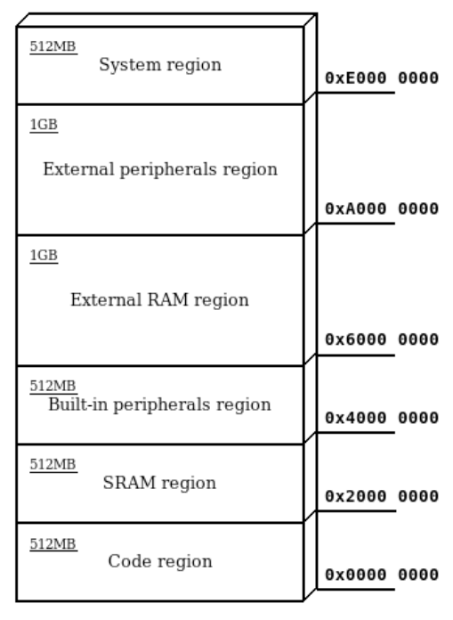
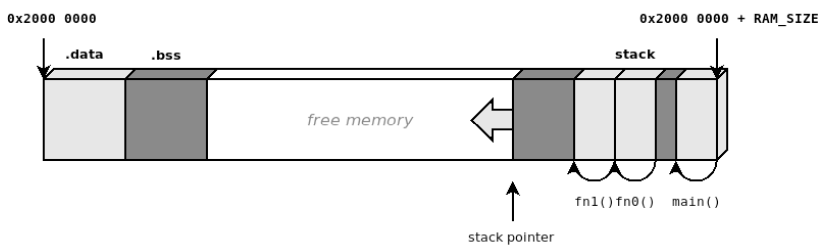
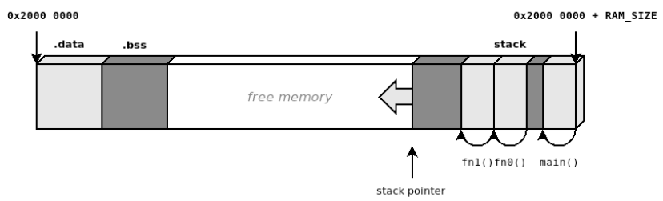
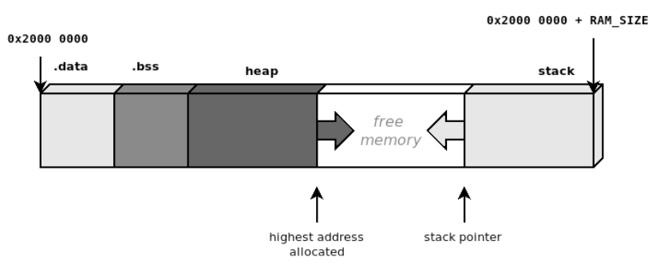
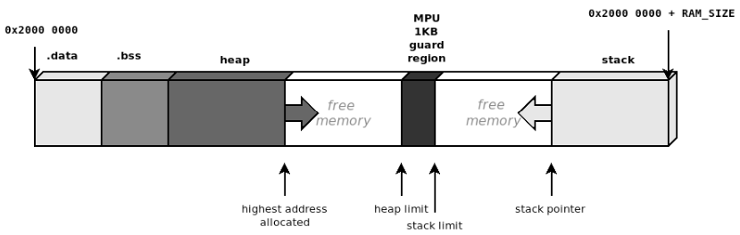

# 5 Memory Management

## 5.1 전체 memory space

> 4장에서 살핀 core register는 address가 mapping되지 않는다. 대신 assembly language의 register name을 이용해서 access가 가능하다.(C 언어에서는 C의 inline assembly language를 사용하면 된다.)

MCU에서 address 지정이 가능한 memory space는 address bus width들에 따라 다 다르다. 예를 들어, 32-bit address bus를 가진 MCU는 2^32개의 address(=4GB)를 가질 수 있다.

> 32bit register는 1byte*2^32 = 4,294,967,296개, 즉 4GB의 address space를 표현할 수 있다.

예를 들어 ARM Cortex-M4(4GB)의 system address map는 6개의 큰 구역으로 나뉘며, 각기 다른 권한을 갖는다.

> 개발자가 linker scripter와 source code에서 사용 가능한 address space를 파악하기 위해서는, target platform의 hardware의 memory section을 올바르게 파악해야 한다.(data sheet 참조)

- Code region

    `.text`나 `.rodata` section처럼 RO로 flash에 저장된 내용들이 mapping된다.

    따라서 IVT와 관련된 내용도 여기에 포함된다.

    또한 0이 아닌 초깃값으로 정의된 symbol도 이 space에 포함된다. 하지만 runtime 시 수정될 수 있기 때문에, write가 가능한 구역으로 copy 또는 relocation이 이루어진다.

- SRAM region

    `.data`나 `.bss` section처럼 RW로 SRAM에 저장된 내용들이 mapping된다. 이 구역은 read/write가 가능하다.

- Peripheral region

    peripheral(GPIO port, UART, I2C, timer 등의 register를 가리킨다.)과 관련된 내용들이 mapping된다. 이 구역은 read만 가능하다. (write는 불가능)

    > [periphrals registers access](https://microcontrollerslab.com/accessing-memory-mapped-io-microcontrollers-pointer/)

- System region

    system에 저장된 내용들이 mapping된다. 이 구역은 read만 가능하다. (write는 불가능)

    processor를 위한 system control register들과 peripheral control register들이 포함된다.

---

## 5.2 Stack

ARM Cortex-M의 stack은 SRAM에 위치한다. stack은 LIFO(Last In First Out) 구조를 가지며, stack pointer는 stack의 top을 가리킨다.

- stack은 데이터에 접근하는 방식 덕택에 빠르다. 새로운 데이터를 넣어두기 위한 공간 혹은 데이터를 가져올 공간을 검색할 필요가 전혀 없이, 항상 stack의 top(꼭대기)를 이용하기 때문이다. 

- stack을 빠르게 해주는 또 다른 특성은 stack에 담긴 모든 data가 결정되어 있는 고정된 size를 갖고 있어야 한다는 점이다.

stack size를 미리 상수로 결정해서 넘겨주기 때문에, compile time에 IVT에 고정된 size로 정의가 된다. 그리고 (2.2.2절에서도 잠시 언급했지만) stack pointer를 해당 영역의 가장 높은 address에 위치시킨 뒤 낮은 주소로 자라게끔 한다.

> data structure에서는 위로 자라는 형식으로 stack이 구현되어 있다. 하지만 memory 상에서 stack pointer는 가장 높은 주소를 가리키고 있기 때문에, stack pointer를 이용해서 stack에 접근할 때는 stack pointer를 이용하는 것이 아니라, stack pointer보다 낮은 주소를 이용해야 한다.

이처럼 size가 정해져 있기 때문에 stack overflow를 염두하고 stack을 사용해야 한다. 따라서 재귀함수처럼 stack 사용량을 예측하고 추적하기 어려운 code는 지양하는 편이 좋다.

> stack overflow가 발생하면 stack pointer가 stack의 가장 낮은 주소를 가리키게 되고, 이후 stack에 접근할 때는 stack pointer보다 더 낮은 주소를 가리키게 되어 stack에 접근할 수 없게 된다.

또한 dynamic memory의 heap 영역이 stack 영역과 반대 방향으로 자라기 때문에, 이 둘의 영역이 겹치게 되면 충돌이 발생할 수 있다.

> 필요한 stack size를 결정하는 algorithm으로 stack painting 등을 사용할 수 있다. 

---

## 5.3 heap

compile time에 size가 결정되어 있지 않거나 size가 변경될 수 있는 데이터를 위해서는, heap에 data를 저장해야 한다. 

> embedded system은 안전이 제일 중요하기 때문에, 일반적으로는 어떤 dynamic memory allocation도 허용하지 않는다. 하지만 영역을 완벽하게 제어할 수 있도록 여러 규칙을 지켜서 heap을 사용할 수도 있다.

heap은 stack 조금 더 복잡하다. data를 heap에 넣을 때, 먼저 저장할 공간이 있는지 확인한다. 그러면 OS가 있을 경우, 충분히 커다란 heap 안의 빈 어떤 지점을 찾아서 이 곳을 사용중이라고 표시해 준 뒤, 해당 지점의 pointer를 사용자에게 반환한다.

이 절차를 allocating on the heap이라고 부른다.(종종 "allocating"으로 줄여 부른다.) 제거하는 것은 반대로 deallocating이라고 하며, 사용자가 pointer를 반환하면 OS는 해당 지점을 더 이상 사용중이 아니라고 표시해 준다.

> 사용자는 이 pointer를 이용해 heap에 있는 데이터에 접근할 수 있다.

> 반면 stack에 data를 pushing하는 것은 allocating에 해당되지 않는다. stack은 compile time에 size가 결정되어 있기 때문이다.

따라서 heap에 저장된 data에 접근하는 건 stack보다 느릴 수밖에 없다. 그 특성상 pointer가 가리키는 곳을 따라가야 하며, 또한 멀리 떨어진 data들을 가져와서 사용해야 할 수도 있기 때문이다.

> pointer를 사용하는 것 자체도 memory를 더 잡아먹는 요인이다.

> 게다가 code의 어느 부분이 heap의 어떤 data를 사용하는지 추적하기가 어렵다. 이는 heap에 있는 data를 사용하는 코드가 많아질수록 더욱 그렇다.

heap의 중복된 data 양을 최소화할 수 있어야 하며, 사용하지 않는 data들도 제거하며 space가 모자라지 않게 관리할 수 있어야 한다.(fragmentation 방지)

> 프로그래밍 언어 Rust는 소유권이라는 개념을 도입해서 이러한 문제를 해결한다.

embedded system에서 heap을 사용할 경우 고려해야 하는 문제는 다음과 같다.

- allocate된 memory의 state, size를 계속해서 추적

- Heap-Stack 충돌 방지를 위한 heap의 상위 boundary 설정

- 여유 memory space가 부족할 경우의 policy 설정

  > 일반적으로는 요청 무시나 지연으로 설정한다.

- memory의 external fragmentation을 처리할 방법, 최소한으로 유지할 방법을 구현

- heap 사용 오류를 방지하기 위한 방법

  > heap overflow, heap underflow, double free, free 미사용 등

---

### 5.3.1 MPU(Memory Protection Unit)

> [MMU와 MPU의 차이](https://xenostudy.tistory.com/10)

MPU는 RAM에서 memory protection을 구현하기 위한 hardware이다. MPU는 memory region을 설정하고, 해당 region에 대한 접근 권한(읽기/쓰기 허가, 실행 허가 등)을 설정한다.

> 따라서 권한이 없는 program이나 process가 해당 region에 접근하려고 하면, MPU가 해당 region에 대한 접근을 차단한다.(processor mode도 함께 체크한다.)

MMU가 없어서 virtual memory를 사용할 수 없는 MCU에서는 MPU를 사용해서 section을 명확히 구분한다.

위 그림은 heap과 stack 사이에 MPU(1KB **guard region**을 선언)를 두어, heap과 stack이 서로 충돌하지 않도록 한 예시다.

---